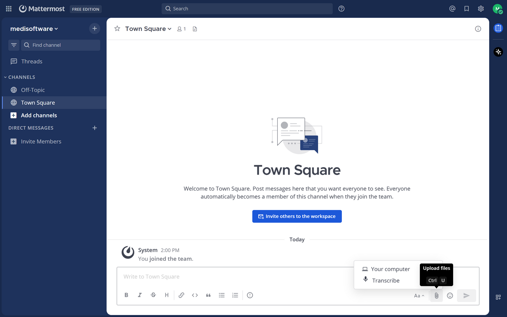
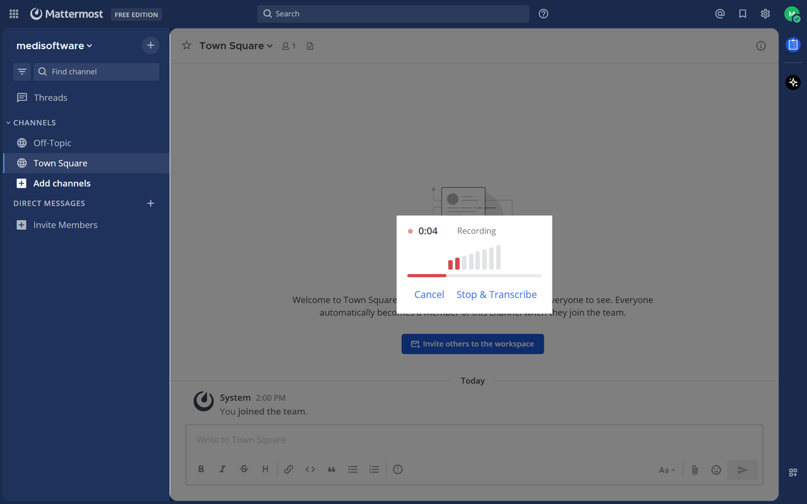
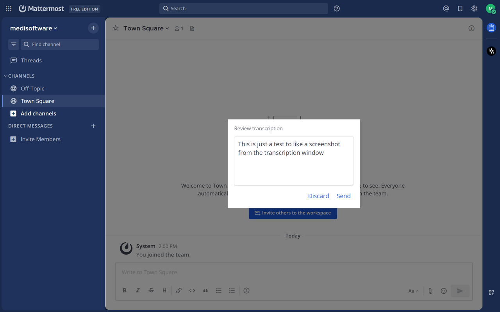
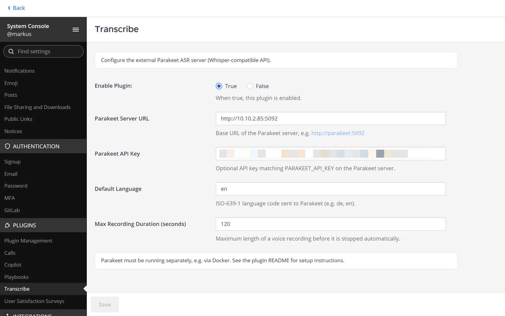

# Mattermost Transcribe Plugin

Record voice in Mattermost, transcribe it with on-premises [Parakeet](https://github.com/achetronic/parakeet) ASR, review the text, and send it as a channel message.

**Plugin ID:** `de.medisoftware.mattermost-transcribe`  
**Current version:** 0.1.0

## Features

- Microphone button in the message input (next to file upload)
- `/transcribe` slash command (web/desktop client)
- Live microphone level indicator while recording
- **Review step** — edit the transcript before posting
- Server-side proxy to Parakeet (API key stays on the server)
- German and English UI strings

## Requirements

- Mattermost server 6.2.1+
- Parakeet ASR server (external, e.g. Docker)
- Web or desktop client (mobile apps are not supported)
- HTTPS for microphone access in the browser

## Parakeet Setup

Run Parakeet as a separate service. The official Docker image includes ONNX Runtime, models, and ffmpeg.

### Recommended Docker Compose

The image defaults to **`-workers 4`**, which pre-allocates several ONNX decoder sessions and can consume multiple gigabytes of RAM. For production we run **one worker** and cap container memory so a growing process cannot take down the host.

Example for a **16 GiB** LXC/VM (~30 Mattermost users, moderate voice-message usage):

```yaml
services:
  parakeet:
    image: ghcr.io/achetronic/parakeet:latest
    ports:
      - "5092:5092"
    environment:
      - PARAKEET_API_KEY=your-secret-key
    command:
      - "-models"
      - "/models"
      - "-workers"
      - "1"
      - "-log-level"
      - "info"
    mem_limit: 8g
    cpus: 8
    restart: unless-stopped
    healthcheck:
      test: ["CMD", "curl", "-f", "http://localhost:5092/health"]
      interval: 30s
      timeout: 5s
      retries: 3
      start_period: 60s
```

| Setting | Suggested value | Notes |
|---------|-----------------|-------|
| `-workers` | `1` | One transcription at a time; extra requests queue at Parakeet |
| `mem_limit` | `8g` on a 16 GiB host | Leaves headroom for the OS; container restarts on OOM |
| `cpus` | `8` on a 16-core host | Enough for a single ONNX job; host stays responsive |
| `healthcheck` | `/health` | Image includes `curl`; status shows as `healthy` in `docker ps` |

Scale `mem_limit` and `cpus` with your host (e.g. `mem_limit: 4g` / `cpus: 4` on an 8 GiB VM). Use `-workers 2` only if users often transcribe in parallel and you accept higher RAM use.

Verify the service:

```bash
curl http://localhost:5092/health
docker ps   # STATUS should include (healthy)
```

If Mattermost and Parakeet run in Docker on the same network, use the container hostname (e.g. `http://parakeet:5092`) instead of `localhost`.

**Mattermost QA / reviewers:** see [docs/PARAKEET-QA.md](docs/PARAKEET-QA.md) for a minimal Docker stack and version requirements.

### Operations notes (MediSoftware experience)

These notes come from running Parakeet behind this plugin in production-like tests.

**Memory does not fully return after transcription.** After a container restart, idle usage can be very low (on the order of tens of MiB). Each transcription loads ONNX encoder/decoder work and ffmpeg (WebM from the browser). When the job finishes, CPU drops, but **RSS often stays elevated** — Go and ONNX Runtime frequently keep memory in the process instead of returning it to the OS. Proxmox/LXC graphs can show stepwise RAM growth per transcription even with `-workers 1`. This is retention/allocator behaviour, not necessarily a leak in the plugin.

**More RAM alone does not fix it.** We observed the same pattern on 4 GiB, 8 GiB, and 16 GiB VMs: the ceiling moves, but memory still accumulates across requests unless the process is restarted.

**Multi-user behaviour (~30 users).** With `-workers 1`, Parakeet handles one job at a time; others wait in its HTTP queue. The plugin waits up to **60 seconds** per request (`server/transcribe.go`). Sporadic use (one or two people at a time) is fine; several simultaneous long recordings can cause waits or timeouts. The plugin does not queue on the Mattermost side.

**Mitigations that helped:**

- Always set `-workers` explicitly (do not rely on the default `4`).
- Set `mem_limit` so runaway RSS restarts the container instead of freezing the VM.
- Add **swap** on the Parakeet host if none is configured (e.g. 2–4 GiB).
- Optional **scheduled restart** (e.g. nightly `docker restart`) as a workaround until upstream improves memory release.
- Monitor with `docker stats` and `free -h`; alert on sustained high container memory or failed `/health`.

### Stable production outcome

After applying the recommended compose settings (`-workers 1`, `mem_limit: 8g`, `cpus: 8`, healthcheck) on a **16 GiB / 16 vCPU** Proxmox LXC with **2 GiB swap**, behaviour stabilised for ~30 Mattermost users:

| Metric | Idle | During transcription |
|--------|------|----------------------|
| RAM | ~2.4 GiB (~15 % of 16 GiB), flat over hours | Short spike, then returns to baseline |
| CPU | ~0 % | Peak ~90 %, drops to idle when the job finishes |
| Swap | 0 % used | Not needed under normal load |

CPU and network spikes align with active transcription only — no sustained high load after jobs complete. This is the expected healthy pattern. The earlier stepwise RAM growth to 100 % was seen on smaller VMs (4–8 GiB) **before** explicit `-workers 1`, `mem_limit`, and swap were in place.

Continue to watch RAM over days of regular use; a slow climb would indicate retention accumulating again and may warrant a scheduled container restart.

**nginx / upload size (Mattermost plugin bundle, not Parakeet):** ensure `client_max_body_size` is **≥ 100M** in every nginx `location` that handles plugin uploads — a global 50M limit caused HTTP 413 for our ~63 MB bundle even when other blocks allowed 100M.

## Installation

1. Build or download `dist/de.medisoftware.mattermost-transcribe-<version>.tar.gz`.
2. Upload via **System Console → Plugins → Plugin Management**.
3. Enable the plugin and configure Parakeet (see below).

The bundle is about 60–65 MB (all platform binaries). Ensure upload limits allow it:

- Mattermost `FileSettings.MaxFileSize` (default often 100 MB)
- Reverse proxy `client_max_body_size` (e.g. nginx) must be **≥ 100M** in every `location` block that handles `/api/v4/plugins`

## Plugin Configuration

| Setting | Description | Default |
|---------|-------------|---------|
| Parakeet Server URL | Base URL of Parakeet | `http://localhost:5092` |
| Parakeet API Key | Optional bearer token | empty |
| Default Language | ISO-639-1 code sent to Parakeet | `de` |
| Max Recording Duration | Max seconds per recording | `120` |

## Usage

1. Open a channel in the web or desktop app.
2. Click the microphone icon or type `/transcribe`.
3. Speak, then click **Stop & Transcribe**.
4. Review and edit the transcript in the dialog.
5. Click **Send** to post, or **Discard** to cancel.

## Screenshots

Message input with microphone button:



Recording in progress (timer and level meter):



Review dialog before sending:



Plugin settings in System Console:



## Architecture

```
Browser (MediaRecorder) → Plugin Server → Parakeet /v1/audio/transcriptions
                                ↓
                         Review in client → Text post
```

Audio is recorded as WebM in the browser. The plugin server forwards it to Parakeet's Whisper-compatible API and returns the transcript. The client does not post until the user confirms.

## Build

Recommended on Linux or WSL:

```bash
make dist
```

Output: `dist/de.medisoftware.mattermost-transcribe-<version>.tar.gz` (version from `plugin.json`).

`make dist` uses `build/package_bundle.py` to set executable bits on Linux plugin binaries in the archive (avoids `permission denied` on install).

### Prerequisites

- Go (see `go.mod`)
- Node.js (see `.nvmrc`)
- npm, make, python3

### WSL

Run `make` from a **WSL shell**, not PowerShell or cmd. The Makefile prefers Linux `go`/`npm` over Windows binaries under `/mnt/c/Program Files/...`.

One-time setup:

```bash
bash scripts/install-wsl-node.sh
```

Go is expected at `~/.local/go/bin/go` or on `PATH`. Prefer cloning the repo on the Linux filesystem (`~/...`) rather than `/mnt/c/...` for faster builds and fewer line-ending issues.

### Development

Start a local Mattermost test server with Parakeet (Docker):

```bash
cd mattermost-server-dev
cp .env.example .env
docker compose up -d
```

This starts Mattermost, PostgreSQL, and Parakeet on the same Docker network. See [mattermost-server-dev/README.md](mattermost-server-dev/README.md) for details.

1. Open **http://localhost:8065** and complete the first-run wizard.
2. In **System Console → Plugins → Transcribe**, set **Parakeet Server URL** to `http://parakeet:5092` and **Parakeet API Key** to match `PARAKEET_API_KEY` in `.env` (default `dev-secret-key`).
3. Create a **Personal Access Token** for your admin user (**Profile → Security → Personal Access Tokens**).
4. From the **repository root**:

```bash
export MM_SERVICESETTINGS_SITEURL=http://localhost:8065
export MM_ADMIN_TOKEN=your-token
make watch
```

Plugin uploads and the 100 MB file limit are pre-enabled in `docker-compose.yml`.

For a standalone Parakeet stack (e.g. Marketplace QA), see [docs/PARAKEET-QA.md](docs/PARAKEET-QA.md).

### Versioning

Set the release version in `plugin.json` (`version` field) before `make dist`. The Makefile also provides `make patch`, `make minor`, and `make major` for signed git tags (`v*`).

### CI

GitHub Actions workflow [`.github/workflows/build.yml`](.github/workflows/build.yml):

- **Test** — `make test-ci` on push/PR to `master`
- **Build** — `make dist`, uploads the `.tar.gz` as an artifact
- **Release** — on tags `v*`, attaches the bundle to a GitHub Release

See [CHANGELOG.md](CHANGELOG.md) for version history.

## Security

Report vulnerabilities per [SECURITY.md](SECURITY.md). Use GitHub Security Advisories or
security@medisoftware.de — please do not file public issues for security bugs.

## Limitations

- No mobile native app support (browser microphone APIs)
- No streaming transcription
- Parakeet must be reachable from the Mattermost server
- Maximum audio upload to Parakeet is 25 MB
- Parakeet processes one job per worker; concurrent users may wait or hit the 60 s plugin timeout (see [Operations notes](#operations-notes-medisoftware-experience))
- Parakeet may retain high memory after transcriptions; plan restarts or `mem_limit` (see Parakeet setup above)

## License

MIT License — see [LICENSE](LICENSE).  
Copyright (c) 2026 MediSoftware GmbH & Co. KG
